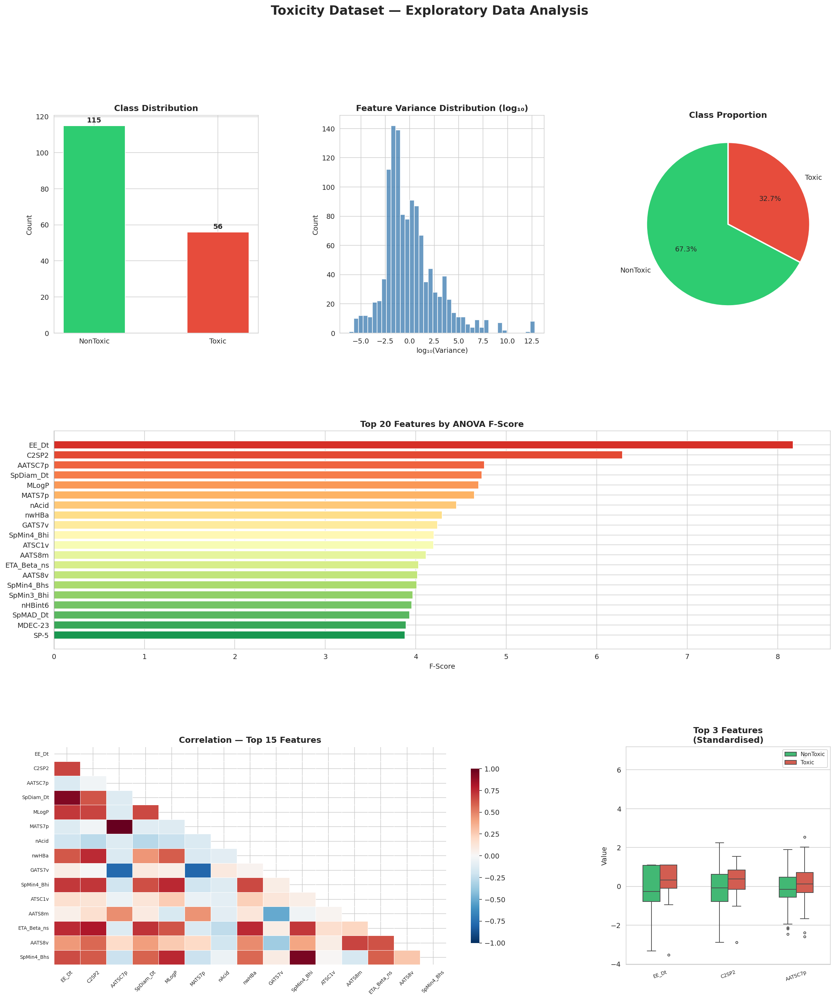
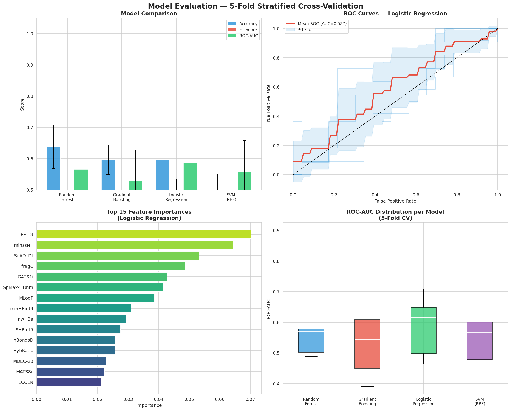

# 🧪 Toxicity Prediction — Machine Learning Pipeline

> **Binary Classification: Toxic vs NonToxic Molecules**  
> Python · scikit-learn · pandas · matplotlib · Jupyter Notebook

---

## 📌 Project Overview

This project presents a complete end-to-end supervised Machine Learning pipeline for predicting the toxicity of chemical molecules. Each molecule is classified as either **Toxic** or **NonToxic** based on its molecular descriptors.

Toxicity prediction is critical in drug discovery, environmental safety, and chemical regulation. Traditional laboratory testing is expensive and time-consuming. This ML pipeline provides a faster, data-driven alternative by learning patterns from known compounds.

---

## 📊 Quick Summary

| Attribute | Detail |
|---|---|
| **Dataset** | 171 molecules, 1,203 molecular descriptors |
| **Target** | Class → Toxic / NonToxic |
| **Class Distribution** | 115 NonToxic (67.3%) · 56 Toxic (32.7%) |
| **Missing Values** | None |
| **Best Model** | Logistic Regression |
| **Best ROC-AUC** | 0.5868 |
| **Validation** | 5-Fold Stratified Cross-Validation |

---

## 📁 Project Structure

```
toxicity-prediction-ml/
├── toxicity_pipeline.py       # Full Python script — complete pipeline end to end
├── toxicity_pipeline.ipynb    # Jupyter Notebook — 14 cells with inline results
├── data-1.csv                 # Raw dataset — 171 molecules, 1,203 features
├── eda_report.png             # EDA visualisation — class distribution, variance, correlations
├── model_results.png          # Model evaluation — comparison, ROC curves, feature importance
└── README.md                  # This file
```

---

## 🔬 Dataset Description

The dataset contains **1,203 molecular descriptors** for **171 chemical compounds**, each labelled as Toxic or NonToxic.

**Feature categories include:**
- Topological descriptors — graph-based structural connectivity of atoms
- Electronic descriptors — charge distribution and polarizability
- Geometric descriptors — molecular shape, volume, and surface area
- Physicochemical properties — LogP, molecular weight, H-bond donors and acceptors
- Autocorrelation descriptors — spatial distribution of atomic properties

> ⚠️ The dataset is **imbalanced** (2:1 ratio). All models were trained with `class_weight='balanced'` to compensate.

---

## 🔍 Exploratory Data Analysis (EDA)

| Finding | Detail |
|---|---|
| Missing values | None |
| Feature mean range | -451.6 to 696,551 — requires scaling |
| Near-zero variance features | 209 features (var < 0.01) |
| Highly correlated pairs (r > 0.95) | 1,875 pairs — redundant features |
| Top features correlated with target | EE_Dt, C2SP2, MLogP, nAcid, nwHBa |

**EDA Visualisations:**



---

## ⚙️ Data Preprocessing

Four sequential steps reduced features from **1,203 → 560**:

| Step | Method | Before | After | Reason |
|---|---|---|---|---|
| 1 | Variance Threshold (< 0.01) | 1,203 | 994 | Remove near-zero variance features |
| 2 | Constant feature removal | 994 | 994 | No constant features found |
| 3 | Correlation filter (r > 0.95) | 994 | 560 | Remove redundant features |
| 4 | StandardScaler | 560 | 560 | Normalise to mean=0, std=1 |

---

## 🎯 Feature Selection

**Method:** ANOVA F-Test (`SelectKBest`, k=50)

Final feature count: **560 → 50**

| Rank | Feature | F-Score | Description |
|---|---|---|---|
| 1 | EE_Dt | 8.17 | Extended eigenvalue topological descriptor |
| 2 | C2SP2 | 6.29 | Count of sp2 carbon atoms bonded to 2 carbons |
| 3 | MLogP | 4.69 | Moriguchi octanol-water partition coefficient |
| 4 | nAcid | 4.45 | Number of acidic functional groups |
| 5 | nwHBa | 4.29 | Weighted count of hydrogen bond acceptors |
| 6 | ATSC1v | 4.20 | Autocorrelation of van der Waals volume at lag 1 |
| 7 | AATS8m | 4.11 | Average autocorrelation of atomic mass at lag 8 |
| 8 | AATS8v | 4.02 | Average autocorrelation of atomic volume at lag 8 |
| 9 | nHBint6 | 3.96 | Number of intramolecular H-bond interactions (path 6) |
| 10 | SpMAD_Dt | 3.93 | Spectral mean absolute deviation of topological matrix |

---

## 🤖 Models Trained

| Model | Type | Key Setting |
|---|---|---|
| **Logistic Regression** | Linear classifier | max_iter=1000, class_weight='balanced' |
| **Random Forest** | Bagging ensemble | 200 trees, class_weight='balanced' |
| **Gradient Boosting** | Boosting ensemble | 150 trees |
| **SVM (RBF Kernel)** | Kernel-based | RBF kernel, class_weight='balanced' |

**Validation:** `StratifiedKFold(n_splits=5, shuffle=True, random_state=42)`

---

## 📈 Results

### Model Performance (5-Fold Cross-Validation)

| Model | Accuracy | F1-Score | ROC-AUC | Precision | Recall |
|---|---|---|---|---|---|
| **Logistic Regression ★** | 0.5965 | **0.4107** | **0.5868** | 0.3887 | **0.4500** |
| Random Forest | 0.6376 | 0.1878 | 0.5656 | 0.2729 | 0.1455 |
| SVM (RBF) | 0.4914 | 0.3511 | 0.5582 | 0.2910 | 0.4636 |
| Gradient Boosting | 0.5965 | 0.2421 | 0.5294 | 0.2878 | 0.2167 |

> ★ **Best model:** Logistic Regression — highest ROC-AUC (0.5868) and F1-Score (0.4107)

**Model Evaluation Visualisations:**



---

## 📚 Machine Learning Topics Covered

1. Supervised Learning — Binary Classification
2. Data Preprocessing — Scaling, variance filtering, correlation removal
3. Feature Selection — ANOVA F-Test, SelectKBest
4. Dimensionality Reduction — 1,203 features → 50 features
5. Class Imbalance Handling — `class_weight='balanced'`
6. Label Encoding — Toxic=1, NonToxic=0
7. Stratified K-Fold Cross-Validation — 5 folds
8. Random Forest — Bagging ensemble
9. Gradient Boosting — Boosting ensemble
10. Logistic Regression — Linear classification
11. Support Vector Machine — RBF kernel
12. Accuracy — Evaluation metric
13. Precision — Evaluation metric
14. Recall — Evaluation metric
15. F1-Score — Evaluation metric
16. ROC-AUC — Evaluation metric
17. ROC Curve Analysis — Per-fold and mean curves
18. Feature Importance — Gini and Permutation importance
19. Bias-Variance Tradeoff — CV on small datasets
20. Overfitting Prevention — CV, balanced weights, random state

---

## ▶️ How to Run

### Option A — Python Script
```bash
pip install pandas numpy scikit-learn matplotlib seaborn
python toxicity_pipeline.py
```

### Option B — Jupyter Notebook
```bash
pip install jupyter
jupyter notebook
```
Open `toxicity_pipeline.ipynb` and run each cell with `Shift + Enter`

### Option C — Google Colab *(No installation required)*
1. Go to [colab.research.google.com](https://colab.research.google.com)
2. Click **File > Upload Notebook** → select `toxicity_pipeline.ipynb`
3. Upload `data-1.csv` when prompted
4. Run all cells with `Runtime > Run All`

---

## ⚠️ Challenges and Limitations

- **Small dataset** — only 171 samples creates high variance across CV folds
- **High dimensionality** — 1,203 features with 171 samples is a classic curse of dimensionality
- **Class imbalance** — 2:1 ratio makes Accuracy a misleading metric alone
- **Modest performance** — ROC-AUC of 0.587 is above random (0.5) but reflects data limitations

---

## 🛠️ Tech Stack


---

## 📄 License

This project is licensed under the **MIT License** — free to use, modify, and distribute.

---

*Toxicity Prediction ML Pipeline · Python 3 · scikit-learn · Jupyter Notebook*
